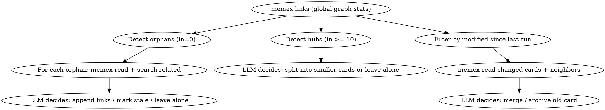

# Memory Organize

You are maintaining a Zettelkasten memory system. Your job is to keep the card network healthy.

## Tools Available

- `memex search [query]` — search cards or list all
- `memex read <slug>` — read a card
- `memex write <slug>` — write/update a card (pipe content via stdin)
- `memex links` — global link graph statistics
- `memex links <slug>` — specific card's inbound/outbound links
- `memex archive <slug>` — move card to archive

## Process

1. Run `memex links` to get global link graph stats
2. **Orphan detection**: For cards with 0 inbound links:
   - `memex read` the orphan
   - `memex search` for potentially related cards
   - Decide: append a link from a related card to this orphan, or leave alone if truly standalone
3. **Hub detection**: For cards with >= 10 inbound links:
   - `memex read` the hub and its linkers
   - Decide: is this card too broad? Should it be split into smaller atomic concepts?
4. **Contradiction/staleness detection**: For recently modified cards:
   - `memex read` the card and its neighbors (linked cards)
   - Check for contradictions or outdated information
   - Decide: merge, archive, or leave alone

## Incremental Strategy

1. Read last run date: `cat ~/.memex/.last-organize 2>/dev/null`
2. If the file exists, only process cards where frontmatter `modified` >= that date, plus their linked neighbors
3. If the file doesn't exist, this is the first run — process all cards
4. After completing all checks, write today's date: `echo "YYYY-MM-DD" > ~/.memex/.last-organize` (use actual date)

When the organize skill creates new cards (e.g., splitting hubs), use `source: organize` in the frontmatter.

## Operation Rules

- **Append only**: When adding links to existing cards, append to the end of the body. Never modify existing prose.
- **Merge**: Read both cards, append source content to target card via `memex write`, then `memex archive` the source.
- **Archive**: Use `memex archive <slug>` to move stale cards out of active search.
- **Be conservative**: When in doubt, leave cards alone. It's better to under-organize than to break useful connections.
