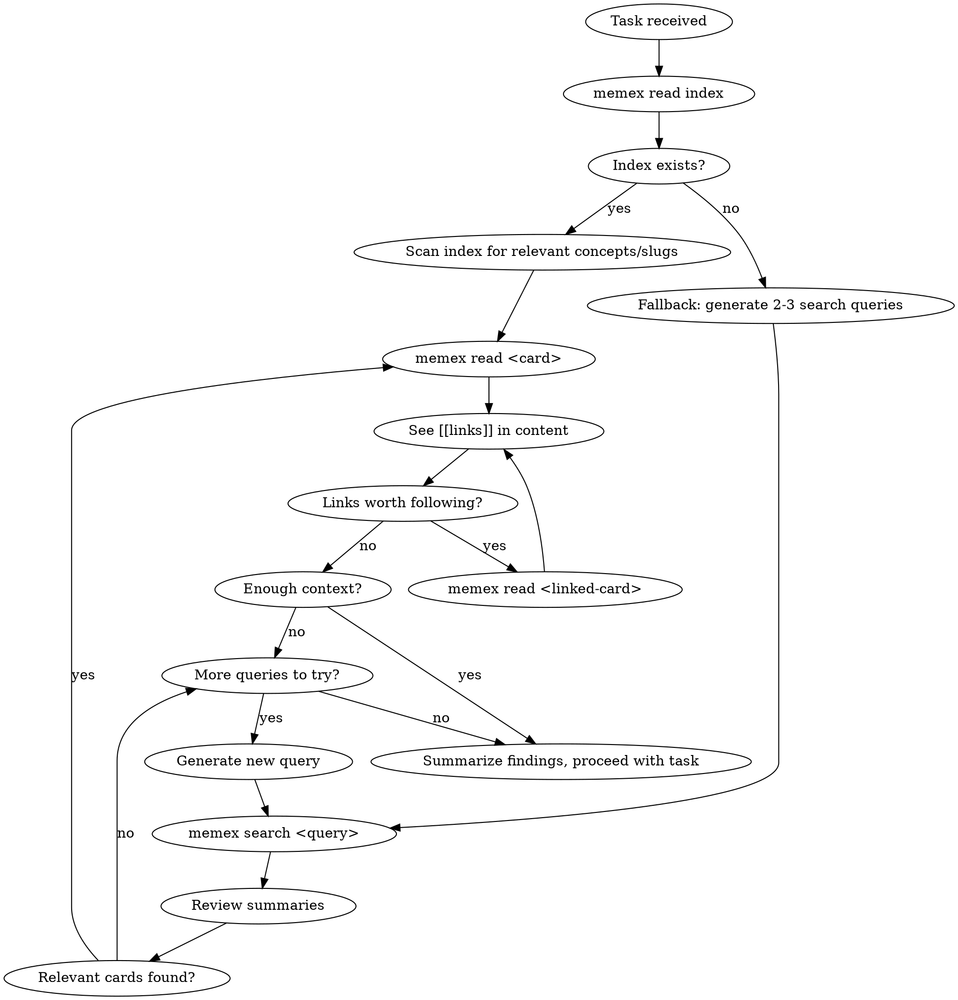

# Memory Recall

You have access to a Zettelkasten memory system via the `memex` CLI. Before starting this task, search your memory for relevant prior knowledge.

## Tools Available

Three equivalent interfaces — use whichever your environment supports:

| CLI (memex in PATH) | Plugin CLI fallback (Claude Code) | MCP tool (VSCode / Cursor) |
|----------------------|-----------------------------------|----------------------------|
| `memex read index`   | `node ~/.claude/plugins/cache/cc-plugins/memex/*/dist/cli.js read index` | `memex_read` with slug `index` |
| `memex search <q>`   | `node ~/.claude/plugins/cache/cc-plugins/memex/*/dist/cli.js search <q>` | `memex_search` with query arg |
| `memex read <slug>`  | `node ~/.claude/plugins/cache/cc-plugins/memex/*/dist/cli.js read <slug>` | `memex_read` with slug arg |
| `memex search` (no args) | `node ~/.claude/plugins/cache/cc-plugins/memex/*/dist/cli.js search` | `memex_search` with no args |

**Resolution order:** Try `memex` in PATH first. If not found, define a shell function and use it:

```bash
memex() { node $HOME/.claude/plugins/cache/cc-plugins/memex/*/dist/cli.js "$@"; }
```

If both CLI approaches fail, use MCP tools.

The rest of this skill uses `memex` CLI syntax for brevity.

## Process



### Step 1: Read the keyword index

Run `memex read index` first. The index is a curated concept → card mapping (Luhmann's Schlagwortregister). It's much smaller than all cards combined and gives you the best entry points.

If the index doesn't exist yet (card not found), fall back to Step 2.

### Step 2: Targeted reads or keyword search

- **If index exists**: Pick the most relevant slugs from the index and `memex read` them directly.
- **If no index**: Generate 2-3 search keywords (try both Chinese and English terms) and run `memex search <keyword>` for each.

### Step 3: Follow links

When you read a card and see `[[links]]` in the prose, decide if they're worth following. If yes, `memex read <linked-slug>`.

### Step 4: Summarize and proceed

When you have enough context, summarize your findings and proceed with the task.

## Guardrails

- **max_hops: 3** — Do not follow links more than 3 levels deep
- **max_cards_read: 20** — Do not read more than 20 cards in a single recall
- If you hit either limit, stop and work with what you have

## Counting Rules

- Hop 0 = cards found directly via index or `memex search`. Following a `[[link]]` from there is hop 1, etc.
- Keep a running count of `memex read` calls. If you've read 20 cards, stop immediately.

## Important

- Always try `memex read index` first — it's the fastest path to relevant cards
- Generate search queries in BOTH Chinese and English to maximize recall
- If search returns nothing useful, that's fine — proceed without memory context
- Summarize what you found before proceeding, so the findings are in your context
