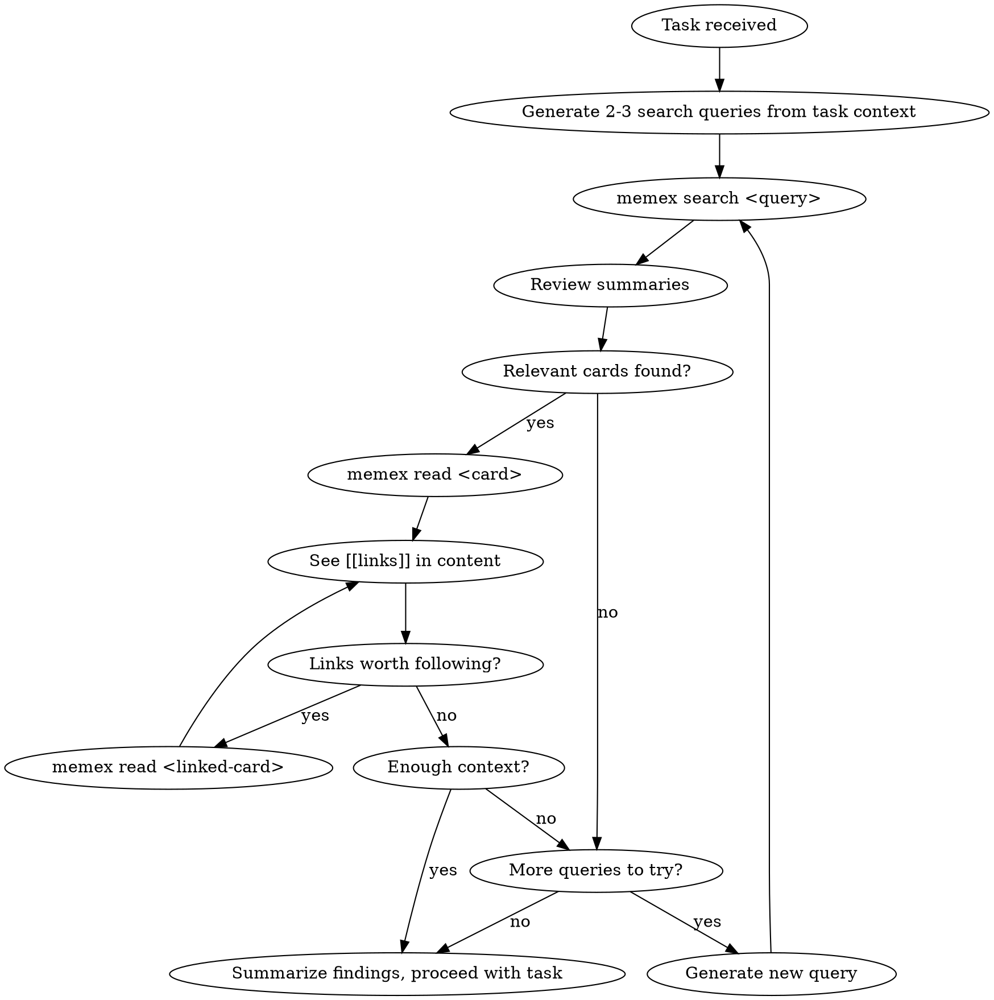

# Memory Recall

You have access to a Zettelkasten memory system via the `memex` CLI. Before starting this task, search your memory for relevant prior knowledge.

## Tools Available

- `memex search <query>` — full-text search, returns card summaries with links
- `memex read <slug>` — read a card's full content
- `memex search` (no args) — list all cards

## Process

1. From the task description, generate 2-3 search keywords (try both Chinese and English terms)
2. For each keyword, run `memex search <keyword>`
3. Review the summaries. For interesting cards, run `memex read <slug>`
4. When you see `[[links]]` in a card, decide if they're worth following — if yes, `memex read <linked-slug>`
5. When you have enough context, summarize your findings and proceed with the task
6. If the current path is exhausted but you need more, try a different keyword

## Guardrails

- **max_hops: 3** — Do not follow links more than 3 levels deep
- **max_cards_read: 20** — Do not read more than 20 cards in a single recall
- If you hit either limit, stop and work with what you have

## Counting Rules

- Hop 0 = cards found directly via `memex search`. Following a `[[link]]` from a search result is hop 1, following a link from that card is hop 2, etc.
- Keep a running count of `memex read` calls. If you've read 20 cards, stop immediately regardless of hop depth.

## Important

- Generate search queries in BOTH Chinese and English to maximize recall
- If search returns nothing useful, that's fine — proceed without memory context
- Summarize what you found before proceeding, so the findings are in your context
