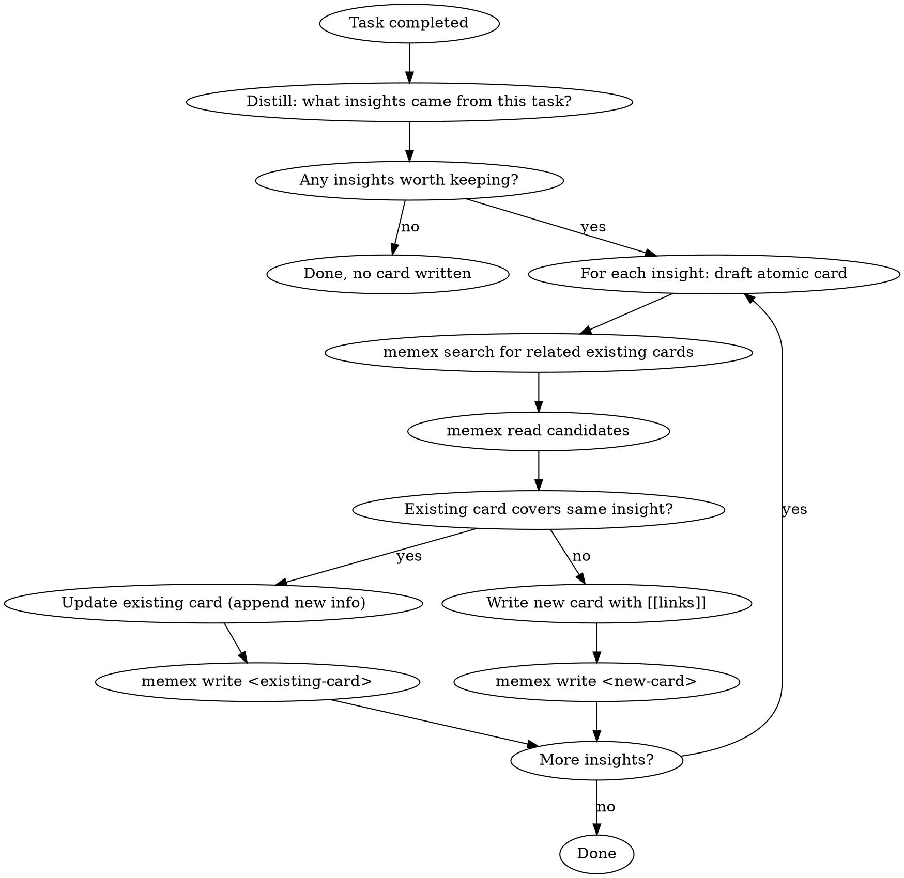

# Memory Retro

You have access to a Zettelkasten memory system via the `memex` CLI. After completing this task, reflect on what you learned and save valuable insights.

## Tools Available

- `memex search <query>` — search existing cards
- `memex read <slug>` — read a card's full content
- `memex write <slug>` — write a card (pipe content via stdin)

## Process



1. Ask yourself: what did I learn from this task that would be useful in the future?
2. If nothing worth remembering, skip — not every task produces insights
3. For each insight, draft an **atomic card** (one insight per card)
4. Before writing, `memex search` for related existing cards
5. **Dedup check**: If an existing card already covers this insight, `memex read` it, then update it by appending new information (use `memex write` with the full updated content)
6. If it's genuinely new, write a new card with `[[links]]` to related cards in the prose

## Card Format

```markdown
---
title: <descriptive title>
created: <today's date YYYY-MM-DD>
source: retro
---

<One atomic insight, written in your own words.>

<Natural language sentences with [[links]] to related cards, explaining WHY they're related.>
```

Note: You do NOT need to include `modified` — the CLI auto-sets it on write.

## Rules

- **Atomic**: One insight per card. If you have 3 insights, write 3 cards.
- **Own words**: Don't copy-paste. Distill and rephrase — this is the Feynman method.
- **Link in context**: `[[links]]` must be embedded in sentences that explain the relationship.
  - Good: "This contradicts what we found in [[jwt-migration]] — stateless tokens can't be revoked."
  - Bad: "Related: [[jwt-migration]]"
- **Slug**: English kebab-case, descriptive. e.g., `jwt-revocation-blacklist-pattern`
- **Don't over-record**: Only save insights that would change how you approach a similar task in the future.
- **Preserve source on update**: When updating an existing card, preserve its original frontmatter fields (title, created, source). Only append to the body.
